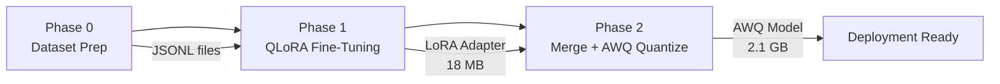

# 🦙 LLaMA 3.2 3B — Multi-Task Fine-Tuning, Merging & AWQ Quantization

A complete, end-to-end pipeline for fine-tuning **Meta's LLaMA 3.2 3B** into a lightweight, multi-task instruction-following model using **QLoRA (8-bit)**, followed by **LoRA merging** and **AWQ 4-bit quantization** for efficient deployment.

> **Built as a capstone project** demonstrating practical expertise in LLM fine-tuning, adapter-based training, and model compression techniques.

---

## 🎯 Project Objectives

1. **Fine-tune** LLaMA 3.2 3B on multiple tasks using parameter-efficient methods (LoRA)
2. **Merge** trained LoRA adapters back into the base model
3. **Quantize** the merged model to 4-bit using AWQ for deployment on consumer hardware
4. Demonstrate the full lifecycle: **raw data → processed datasets → fine-tuned model → quantized model**

---

## 🧠 Supported Tasks

| Task | Description | Training Data |
|------|-------------|---------------|
| **Summarization** | Condensing scientific papers and conversations | 602 samples (ArXiv + SamSum) |
| **Persona Roleplay** | Responding as Chandler Bing from *Friends* | 241 generated samples |
| **Conversational AI** | General chat capabilities | Optional (extensible) |

---

## 🏗️ Architecture & Technical Stack

```
Base Model: meta-llama/Llama-3.2-3B (3 billion parameters)
├── Quantization: 8-bit (bitsandbytes) for training
├── Adapter: LoRA (r=6, alpha=8, dropout=0.05)
├── Target Modules: q_proj, k_proj, v_proj, o_proj, gate_proj, up_proj, down_proj
├── Training: SFTTrainer (TRL) with paged_adamw_8bit optimizer
└── Deployment: AWQ 4-bit quantization (GEMM, group_size=128)
```

| Component | Tool/Library |
|-----------|-------------|
| Base Model | `transformers` (HuggingFace) |
| LoRA Adapters | `peft` (Parameter-Efficient Fine-Tuning) |
| Training | `trl` (SFTTrainer) |
| 8-bit Quantization | `bitsandbytes` |
| 4-bit Deployment Quantization | `autoawq` |
| GPU | Google Colab T4 (15 GB VRAM) |

---

## 📂 Project Structure

```
finetunnig llama 3b/
│
├── README.md                               # This file
├── LICENSE                                  # Project license
│
├── generate_chandler.py                     # Phase 0: Generate Chandler Bing persona dataset
├── preprocess_datasets.py                   # Phase 0: Preprocess & format all datasets
│
├── data/
│   ├── raw/                                 # Raw source datasets
│   │   ├── summarization/                   #   ArXiv + SamSum data
│   │   ├── persona/                         #   Chandler Bing data
│   │   └── chat/                            #   Chat data (optional)
│   └── processed/                           # Phase 0 output (ready for training)
│       ├── summarization_prepared.jsonl      #   2,000 summarization samples
│       └── persona_prepared.jsonl            #   241 persona samples
│
├── phase1_qlora_finetuning.ipynb            # Phase 1: QLoRA fine-tuning notebook (template)
├── phase_1_finetunning.ipynb                # Phase 1: Executed Colab notebook (with outputs)
│
├── phase2_merge_quantize.ipynb              # Phase 2: Merge + quantize notebook (template)
└── phase_2_merge_and_quantization.ipynb     # Phase 2: Executed Colab notebook (with outputs)
```

---

## 🔄 Pipeline Overview

The project follows a **3-phase pipeline**:



### Phase 0 — Dataset Preparation (Local)

**Scripts:** `generate_chandler.py`, `preprocess_datasets.py`

Prepares three datasets into a unified instruction-tuning format:

```json
{
  "instruction": "<task prompt>",
  "input": "<context or input text>",
  "output": "<expected model response>"
}
```

**Data Sources:**

| Dataset | Source | Samples | Purpose |
|---------|--------|---------|---------|
| ArXiv | HuggingFace `ccdv/arxiv-summarization` | 1,500 | Scientific paper summarization |
| SamSum | HuggingFace `samsum` | 500 | Conversational summarization |
| Chandler Bing | Custom generated (`generate_chandler.py`) | 241 | Persona roleplay |

**Output:** `summarization_prepared.jsonl` (2,000 samples) + `persona_prepared.jsonl` (241 samples)

---

### Phase 1 — QLoRA Fine-Tuning (Google Colab T4)

**Notebook:** `phase1_qlora_finetuning.ipynb` / `phase_1_finetunning.ipynb`

Fine-tunes LLaMA 3.2 3B using 8-bit quantization and LoRA adapters on a T4 GPU.

#### Training Configuration

| Parameter | Value |
|-----------|-------|
| Base Model | `meta-llama/Llama-3.2-3B` |
| Quantization | 8-bit (`load_in_8bit=True`) |
| LoRA Rank (r) | 6 |
| LoRA Alpha | 8 |
| LoRA Dropout | 0.05 |
| Optimizer | `paged_adamw_8bit` |
| Learning Rate | 2e-5 |
| LR Scheduler | Cosine |
| Warmup Ratio | 0.03 |
| Batch Size | 1 (gradient accumulation = 8, effective = 8) |
| Epochs | 3 |
| Max Sequence Length | 512 |
| Gradient Checkpointing | Enabled |

#### Training Format

All samples are formatted using the instruction template:

```
### Instruction:
<task-specific prompt>

### Input:
<context or user input>

### Response:
<expected output>
```

#### Training Results

| Metric | Value |
|--------|-------|
| Training Samples | 758 (90% of 843) |
| Validation Samples | 85 (10% of 843) |
| Total Steps | 285 |
| Final Train Loss | **2.1546** |
| Final Eval Loss | **2.2194** |
| Training Time | ~1 hour 42 minutes |
| Trainable Parameters | ~18 MB (LoRA adapters only) |

> ✅ Train-eval loss gap is small (0.065), indicating **no overfitting**.

#### Sample Generation (Step 200)

**Summarization:**
> *"This article explores deep learning approaches for natural language processing (NLP) tasks such as machine translation, summarization, and question answering."*

**Chandler Bing:**
> *"I have a better idea. Let's go get a massage."*

---

### Phase 2 — LoRA Merge & AWQ Quantization (Google Colab T4)

**Notebook:** `phase2_merge_quantize.ipynb` / `phase_2_merge_and_quantization.ipynb`

#### Step 1: Merge LoRA into Base Model

```python
from peft import PeftModel
model = PeftModel.from_pretrained(base_model, adapter_dir)
merged_model = model.merge_and_unload()  # LoRA weights baked into base model
```

#### Step 2: AWQ 4-bit Quantization

| AWQ Parameter | Value |
|--------------|-------|
| Weight Bits | 4 |
| Group Size | 128 |
| Zero Point | True |
| Version | GEMM |
| Calibration | `pileval` (214,670 samples) |
| Quantization Time | ~22 minutes |

#### Model Size Comparison

| Model Version | Size | VRAM Required |
|--------------|------|---------------|
| Original (FP32) | ~12 GB | ~12 GB |
| 8-bit Quantized (training) | ~6.4 GB | ~6.4 GB |
| FP16 Merged | ~6.4 GB | ~6.4 GB |
| **AWQ 4-bit (final)** | **2.1 GB** | **~3 GB** |

> 📉 **5.7× size reduction** from the original model with minimal quality loss.

---

## 🧪 Inference Results (AWQ Quantized Model)

| Test | Prompt | Model Output |
|------|--------|-------------|
| Summarization | *"Alice: Hey, are we meeting at 3? Bob: Yes! Same place. Alice: Perfect."* | *"Alice asks Bob if they are meeting at 3 o'clock and Bob confirms."* |
| Persona | *"Could you BE any more annoying?"* | *"I'm sorry, I don't speak annoying."* |
| Persona | *"I just got a promotion!"* | *"Congratulations on your promotion!"* |
| Summarization | Scientific text about LLMs | Coherent summary about few-shot learning |

---

## 🚀 Quick Start — Inference

### Load the AWQ Quantized Model

```python
from awq import AutoAWQForCausalLM
from transformers import AutoTokenizer
import torch

# Load model (requires ~3 GB VRAM)
model = AutoAWQForCausalLM.from_quantized("./awq_model", fuse_layers=False)
tokenizer = AutoTokenizer.from_pretrained("./awq_model")

# Summarization
prompt = """### Instruction:
Summarize the following conversation:

### Input:
Alice: Hey, are we meeting at 3?
Bob: Yes! Same place.
Alice: Perfect.

### Response:
"""

inputs = tokenizer(prompt, return_tensors="pt").to("cuda")
with torch.no_grad():
    out = model.generate(**inputs, max_new_tokens=100, temperature=0.7, top_p=0.9)
print(tokenizer.decode(out[0], skip_special_tokens=True))
```

### Load the LoRA Adapter (Alternative)

```python
from transformers import AutoModelForCausalLM
from peft import PeftModel

base = AutoModelForCausalLM.from_pretrained("meta-llama/Llama-3.2-3B")
model = PeftModel.from_pretrained(base, "./lora_adapter")
```

---

## 📋 How to Reproduce

### Prerequisites

- Google Colab account (free tier with T4 GPU)
- HuggingFace account with access to `meta-llama/Llama-3.2-3B`
- Python 3.10+

### Step 1: Dataset Preparation (Local)

```bash
# Generate Chandler Bing dataset
python generate_chandler.py

# Preprocess all datasets
python preprocess_datasets.py
```

### Step 2: Fine-Tuning (Colab)

1. Upload `phase1_qlora_finetuning.ipynb` to Google Colab
2. Set runtime: **Runtime → Change runtime type → T4 GPU**
3. Upload `summarization_prepared.jsonl` and `persona_prepared.jsonl`
4. Run all cells (training takes ~1.5–2 hours)
5. Download the LoRA adapter from `/content/out/`

### Step 3: Merge & Quantize (Colab)

1. Upload `phase2_merge_quantize.ipynb` to a **new** Colab notebook
2. Set runtime to **T4 GPU**
3. Mount Google Drive (LoRA adapter loads from Drive)
4. Run all cells (quantization takes ~22 minutes)
5. Download the AWQ model

---

## 📊 Key Metrics Summary

| Metric | Value |
|--------|-------|
| Base Model | LLaMA 3.2 3B |
| Training Method | QLoRA (8-bit + LoRA) |
| Training Data | 843 samples (summarization + persona) |
| Training Time | ~1h 42min on T4 |
| Final Train Loss | 2.1546 |
| Final Eval Loss | 2.2194 |
| LoRA Adapter Size | 18 MB |
| Final Model Size | 2.1 GB (AWQ 4-bit) |
| Inference VRAM | ~3 GB |
| Quantization | AWQ 4-bit (GEMM, group=128) |

---

## 🛠️ Dependencies

```
transformers>=4.45.0
peft>=0.12.0
trl>=0.10.1
datasets>=2.21.0
bitsandbytes>=0.43.0
accelerate>=0.34.0
autoawq
torch>=2.0.0
```

---

## 📈 Future Improvements

- [ ] Add chat dataset (`chat_prepared.jsonl`) for general conversational capability
- [ ] Increase persona training data for richer Chandler Bing responses
- [ ] Experiment with higher LoRA rank (r=16 or r=32)
- [ ] Upload quantized model to HuggingFace Hub
- [ ] Add evaluation benchmarks (ROUGE, perplexity)
- [ ] Build a Gradio/Streamlit demo UI

---

## 📝 License

This project is licensed under the [MIT License](LICENSE).

---

## 🙏 Acknowledgments

- [Meta AI](https://ai.meta.com/) for the LLaMA 3.2 model
- [HuggingFace](https://huggingface.co/) for transformers, PEFT, and TRL libraries
- [MIT HAN Lab](https://github.com/mit-han-lab/llm-awq) for AutoAWQ
- [Google Colab](https://colab.research.google.com/) for free GPU access
- Dataset sources: [ArXiv Summarization](https://huggingface.co/datasets/ccdv/arxiv-summarization), [SamSum](https://huggingface.co/datasets/samsum)
